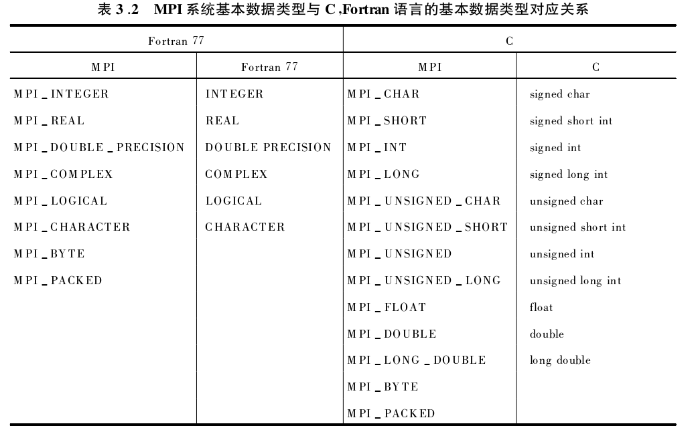
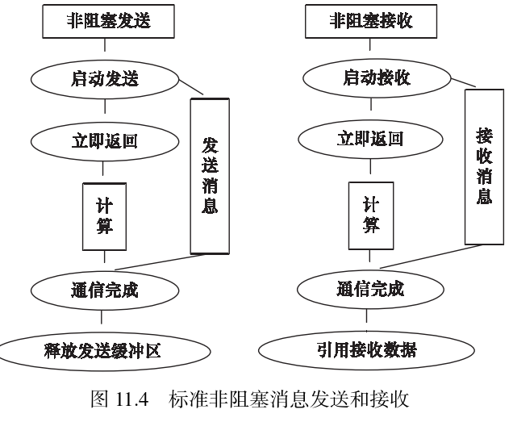

#! https://zhuanlan.zhihu.com/p/694824867
# MPI点对点通信
## 1. 标准模式阻塞通信
MPI库提供的标准模式阻塞式通信函数主要有消息发送函数与`MPI_Send`和消息接收函数`MPI_Recv`，消息收发函数`MPI_Sendrecv`,以及消息法收替换函数`MPI_Sendrecv_replace`。

消息发送函数和接收函数在之前的章节已经介绍，不在此赘述。另外MPI系统提供的预定义数据类型可以查阅下图，其中C++和C语言使用方式一致。


在MPI系统中，消息可以分为**数据**和**信封**两部分组成，信封指的是由发送或接收端的进程号、消息标识、通信域组成。消息的数据部分由消息发送缓冲区包含的数据单元组成，数据单元的个数指消息拥有数据单元的个数，称为**消息长度**，消息包含的数据占有的内存空间（字节为单元）的大小称为**消息大小**。

### 1.1 点对点标准模式的阻塞通信示例
#### 1.1.1 问题描述
启动5个进程统计矩阵A[100][100]的绝对值最大的元素。

#### 1.1.2 问题分析

启动5个进程并行求解，每个进程划分A[20][100]子矩阵求解各自最大元素，然后其余进程将各自最大元素发送至0号进程，0号进程将所有进程最大元素存储在一维数组最后再求解一维数组的最大元素即为最终结果。

#### 1.1.2 代码实现
```cpp
#include "findMaxElement.h"
#include "setArrayValue.h"
#include "getMaxValueInAllRanks.h"
#include <iostream>
#include <algorithm>
#include <mpi.h>
#include <stdio.h>
#include <math.h>
#include <stdlib.h>
#include <vector>

int main(int argc, char** argv)
{
  int size = 0;     // 进程数量
  int rootrank = 0; // root进程号
  int myrank = -1;  // 初始化当前进程号
  int length;
  double xmax = 0.0;
  size_t N = 20, M = 100;
  std::vector<double> c(5, 0.0); // 定义结果存储在一维数组中
  // 声明每个进程的A为20X100的二维数组并初始化为0.0
  std::vector<std::vector<double>> A(N, std::vector<double>(M, 0.0)); 

  char processor_name[MPI_MAX_PROCESSOR_NAME];
  // 初始化MPI环境
  MPI_Init(&argc, &argv);
  // 获取通信域MPI_COMM_WORLD中所有参与计算的进程数目
  MPI_Comm_size(MPI_COMM_WORLD, &size);
  // 获取当前进程的序号
  MPI_Comm_rank(MPI_COMM_WORLD, &myrank);
  // 获取当前进程的名称
  MPI_Get_processor_name(processor_name, &length);

  setArrayValue(A, N, M, myrank);

  xmax = findMaxElement(A); // 求当前进程的A数组的最大值
  // 打印当前进程中的A的最大元素
  std::cout << "Process " << myrank << " has max value = " << xmax << "\n" << std::endl;
 
  c = getArrayOfMaxElements(myrank, xmax, size);
  
  // 在root进程中求c数组的最大值
  if (myrank == rootrank)
  {
    xmax = getResultMaxElement(c, size);
    // 打印最终的结果
    std::cout << "Final xmax = " << xmax << " of " << size << " processes" << ". \n" << std::endl;
  }
  
  // 销毁MPI环境
  MPI_Finalize();

  return 0;
}
```
其中最主要的函数接口为`getArrayOfMaxElements()`获取各进程最大值组成的数组，具体实现如下。这里面实现了除0号进程外，其余4各进程需要向0号进程发送自己计算的最大元素。0号进程执行4次接收操作。
```cpp
std::vector<double> getArrayOfMaxElements(const int iRank, const double xmax, const int rankSize)
{
  MPI_Status status;
  std::vector<double> results(rankSize, 0.0);
  if (iRank > 0)
  {
    // 除了root进程外，其余进程需要将自己的最大值发送给root进程
    MPI_Send(&xmax, 1, MPI_DOUBLE, 0, iRank, MPI_COMM_WORLD);
  }
  else
  {
    results[0] = xmax;  // 先将myrank = 0的最大值存入results[0]
    for (int i = 1; i < rankSize; i++)
    {
      // root进程接收其他进程的最大值并存入results数组
      MPI_Recv(&results[i], 1, MPI_DOUBLE, i, i, MPI_COMM_WORLD, &status);
    }
  }
  return results;
}
```
当然最后的计算结果与预期一致，具体就不在此处展示了。列出代码的目的是为了解释说明这个点对点阻塞通信的基本操作。`MPI_Send`和`MPI_Recv`函数在调用时，需要注意顺序：进程0先执行发送操作，然后执行接收操作，其他进程则相反。不然容易出现**死锁**现象。

>阻塞通信函数，指的是调用该函数后，进程会一直等待直到通信完成，才继续执行后续代码。即在通信完成前，发送和接收进程都会被阻塞，直到消息发送或接收完成才返回。


### 1.2 消息收发函数`MPI_Sendrecv`
消息收发函数同时执行一个阻塞式消息发送和阻塞式消息接收操作。
```cpp
int MPI_Sendrecv(const void* sendbuf, 
                int sendcount, MPI_Datatype sendtype, int dest, int sendtag,
                void* recvbuf, int recvcount, MPI_Datatype recvtype, int source, 
                int recvtag,MPI_Comm comm, MPI_Status* status)
// sendbuf: 发送缓冲区起始地址
// sendcount: 发送消息的数据单元个数
// sendtype: 发送消息的数据类型
// dest: 目标进程号
// sendtag: 发送消息的标签
// recvbuf: 接收缓冲区起始地址
// recvcount: 接收消息的数据单元个数
// recvtype: 接收消息的数据类型
// source: 消息来源进程号
// recvtag: 接收消息的标签
// comm: 通信域
// status: 状态信息
```
当且仅当两个函数执行完毕后，函数`MPI_Sendrecv`才返回。消息发送缓存区和消息接收缓存区必须互不相交。并且该函数可以和`MPI_Send`和`MPI_Recv`函数兼容配合使用，实现点对点通信。另外消息收发函数使用不多，不在此介绍，以后用到了再根据示例说明。

## 2. 标准模式非阻塞通信
顾名思义，标准模式的非阻塞通信就是在标准模式的基础上，增加了一些额外的功能，使得通信过程更加灵活。MPI库提供了`MPI_Isend`和`MPI_Irecv`函数，可以实现非阻塞式的消息发送和接收。

非阻塞式通信中，发送和接收进程发起通信后立即返回，而不会等待通信操作完成。发送进程可以立即执行后续代码，而接收进程在通信完成之前不需要等待可以利用该时间执行其他操作。相比较而言，非阻塞式通信提供了更大的灵活性，但需要额外的代码来处理通信完成后的操作，以确保通信操作的正确性。

### 2.1 非阻塞通信的发送和接收
`MPI_Isend`是`MPI_Send`的非阻塞版本，它启动一个标准非阻塞发送，调用后立即返回。该调用的返回_**只表示该消息可以被发送，并不意味着消息已经成功发送出去**_。

>和阻塞发送`MPI_Send`相比，非阻塞发送多了一个`request`参数,该参数是一个用来描述非阻塞通信状况的对象，通过对该对象的查询可知道与之相对应的非阻塞发送是否成功完成。

```cpp
MPI_Isend(const void* buf, int count, MPI_Datatype datatype, int dest, int tag, MPI_Comm comm, MPI_Request* request)
// buf: 发送缓冲区起始地址
// count: 发送消息的数据单元个数
// datatype: 发送消息的数据类型
// dest: 目标进程号
// tag: 发送消息的标签
// comm: 通信域
// request: 非阻塞发送请求对象
```

`MPI_Irecv`是`MPI_Recv`的非阻塞版本，它启动一个标准非阻塞接收，调用后立即返回。该调用的返回_**只表示该消息可以被接收，并不意味着消息已经成功接收到**_。

>同理，和非阻塞发送一样，非阻塞接收也多了一个`request`参数。通过对该参数的查询，可以知道与之相对应的非阻塞接收是否成功完成。

```cpp
MPI_Irecv(void* buf, int count, MPI_Datatype datatype, int source, int tag, MPI_Comm comm, MPI_Request* request)
// buf: 接收缓冲区起始地址
// count: 接收消息的数据单元个数
// datatype: 接收消息的数据类型
// source: 消息来源进程号
// tag: 接收消息的标签
// comm: 通信域
// request: 非阻塞接收请求对象
```


### 2.2 非阻塞通信的完成和检测

由于非阻塞通信在调用后不需要等待通信完成就可以返回执行其他代码，所以非阻塞通信的返回并不意味着通信的完成。在返回后，用户还要检测甚至等待通信的完成，MPI提供如下函数来实现这些目的。

#### 2.2.1 单个非阻塞通信的完成与检测

1. `MPI_Test`函数检测单个非阻塞通信的完成情况。若调用该函数时非阻塞通信已经完成，则返回`flag = true`，否则返回`flag = false`。
```cpp
int MPI_Test(MPI_Request* request, int* flag, MPI_Status* status)
// request: 非阻塞通信请求对象
// flag: 通信是否完成的标志
// status: 通信状态信息
```

2. `MPI_Wait`函数等待单个非阻塞通信完成。若通信已经完成，会自动释放`request`并将其设置为`MPI_REQUEST_NULL`，该调用还会自动设置返回状态参数`status`。
```cpp
int MPI_Wait(MPI_Request* request, MPI_Status* status)
// request: 非阻塞通信请求对象
// status: 通信状态信息
```
3. 使用方法
```cpp
MPI_Comm_rank(MPI_COMM_WORLD, &myrank);
if (myrank == 0)
{
  // 非阻塞发送消息
  MPI_Isend(sendbuf, count, datatype, dest, tag, MPI_COMM_WORLD, &request);

  // ... 用户可以在此处执行其他操作

  // 等待消息发送完成
  MPI_Wait(&request, &status);
}
else if (myrank == dest)
{
  // 非阻塞接收消息
  MPI_Irecv(recvbuf, count, datatype, source, tag, MPI_COMM_WORLD, &request);

  // ... 用户可以在此处执行其他操作

  // 等待消息接收完成
  MPI_Wait(&request, &status);
}
```
显然，虽然形式上非阻塞通信将阻塞通信拆成两部分来实现，但是用户可以在这两部分调用之间插入其他计算工作或其他MPI调用，实现计算与通信的重叠，提高性能。

#### 2.2.2 多个非阻塞通信的完成与检测

MPI还提供了`MPI_Waitany`、`MPI_Waitsome`和`MPI_Waitall`函数来检测多个非阻塞通信的完成情况。

`MPI_Waitany`函数等待数组`array_of_requests`中任意一个非阻塞通信完成。该函数的调用形式如下：
```cpp
int MPI_Waitany(int count, MPI_Request array_of_requests[], int* index, MPI_Status* status)
// count: 非阻塞通信请求对象的个数
// array_of_requests: 非阻塞通信请求对象数组
// index: 完成的请求对象的索引
// status: 通信状态信息
```
该函数的功能是等待数组`array_of_requests`中`count`个非阻塞通信请求对象的完成，并返回完成的请求对象的索引`index`，并将其对应的通信状态信息存储在`status`中。若所有通信都没有完成，则返回`index = MPI_UNDEFINED`。

`MPI_Waitall`表示所有非阻塞通信请求对象都完成后才返回，第i个非阻塞通信对象对应的通信完成信息存放在`array_of_statuses[i]`中，并释放非阻塞完成对象数组。

`MPI_Waitsome`用于等待一组操作中是否某些完成。

对应的，`MPI_Testany`函数分别用于检测数组`array_of_requests`中任意一个非阻塞通信的完成情况，若是，令`flag = true`，并释放该对象，否则令`flag = false`。

`MPI_Testall`用于检测数组`array_of_requests`中所有非阻塞通信的完成情况。当且仅当所有通信完成，`flag = true`并返回，否则`flag = false`立即返回。

`MPI_Testsome`立即返回，有几个非阻塞通信完成，就令`outcount`等于几，且将完成对象的下标记录在下标数组中。若没有非阻塞通信完成，则返回`outcount = 0`。

以上介绍了MPI提供的标准模式非阻塞通信函数，具体的使用效果需要结合实际的应用场景来操作。下一章准备从求解线性方程组或矩阵乘法等的角度，介绍MPI的并行求解方法。将**标准阻塞通信和非阻塞通信**的实现效果进行对比，熟悉其中的区别和联系。

另外，除了点对点通信外，MPI还有组通信的调用，这些将在后面章节逐一学习并分享笔记。当然，点对点通信除了标准模式，还有缓存模式、同步模式和就绪模式，鉴于这些模式目前使用到不多，而且还未掌握标准通信模式的核心，无法清楚发现这些模式之间的区别，所以后续有需要再进一步学习理解，现阶段主要聚焦于**MPI的标准模式通信调用**。

刚刚使用VSCode编辑器写完这篇笔记，发送时发现图片无法识别，查询后发现是图片名字/路径不能带有中文符号。

码字不易，如有错误，还望指正。如有疑问，欢迎留言交流。点赞、收藏、转发，是对我最大的鼓励！


