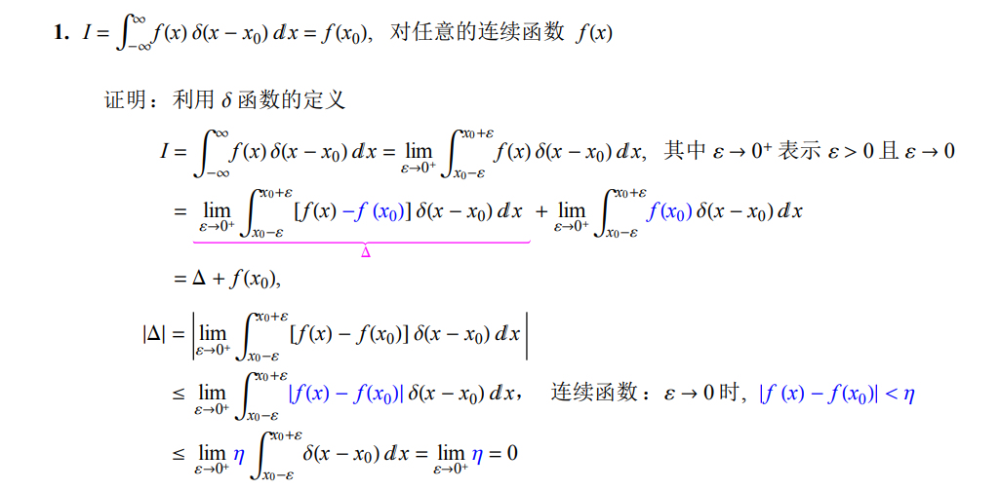
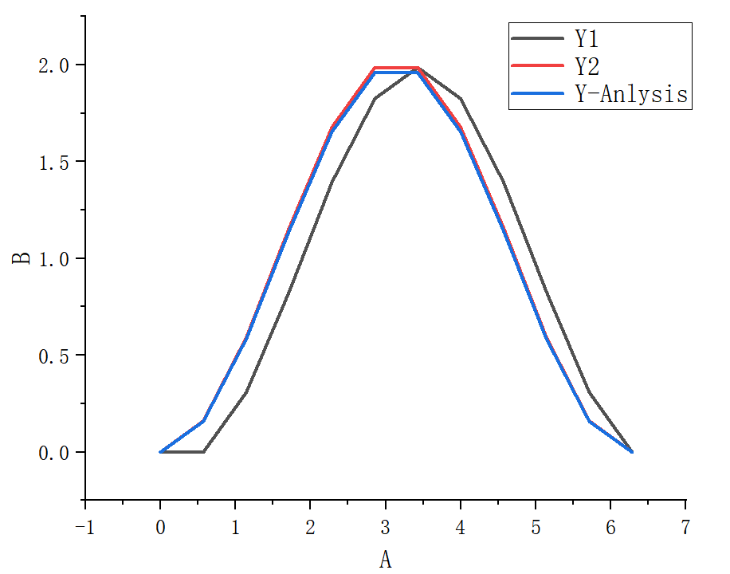

# 2.1 $\delta$函数——狄拉克函数

## 2.1.1 狄拉克函数的定义
$\delta$函数采用两个重要性质定义，分别是紧致性和归一性，如下：
$$
 \delta(x) = 
    \left\{
    \begin{array}{ll}
    0           & x \neq 0,\\
    \infty      & x = 0.
    \end{array}  
    \right.  \tag{2.1} 
$$

$$
\int_{-\infty}^{+\infty} \delta(x) \, dx = 1. \tag{2.2}
$$
其中$\delta(x)$函数其实就是在$x=0$这一点的积分等于1。满足以上两个条件的函数称为$\delta$函数。对于二维、三维空间，公式2.1和2.2可以拓展为：
$$
\delta(\vec{r}) = 
\left\{
    \begin{array}{ll}
    0           & |\vec{r}| \neq 0 \\
    \infty      & |\vec{r}| =  0.
    \end{array}  
    \right. \tag{2.3}
$$

$$
\int\int\int\delta(\vec{r})d\vec{r} = 1 \tag{2.4}
$$
其中$\vec{r}$是一个空间中的位置矢量。显然，在三维空间中$\delta(\vec{r}) = \delta(x)\delta(y)\delta(z)$满足式2.3和2.4。其中公式2.1和2.3称为$\delta$函数的**紧致性**，公式2.2和2.4称为$\delta$函数的**归一性**。

公式2.1和2.3可以推广到空间中任意一点：
$$
 \delta(x) = 
    \left\{
    \begin{array}{ll}
    0           & x \neq 0\\
    \infty      & x = 0.
    \end{array}  
    \right. \quad \Longrightarrow \quad
    \delta(x-x_0) = 
    \left\{
    \begin{array}{ll}
    0           & x \neq x_0\\
    \infty      & x = x_0.
    \end{array}  
    \right. \tag{2.5} 
$$

$$
\delta(x) = 
\left\{
    \begin{array}{ll}
    0           & |\vec{r}| \neq 0 \\
    \infty      & |\vec{r}| =  0.
    \end{array}  
    \right. \quad \Longrightarrow \quad
    \delta(\vec{r}-\vec{r}_0) = 
    \left\{
    \begin{array}{ll}
    0           & \vec{r} \neq \vec{r}_0  \\
    \infty      & \vec{r} = \vec{r}_0.
    \end{array}  
    \right. \tag{2.6}
$$
上述在空间中的推广，相当于从$x$位置平移到$x_0$位置，或者从$\vec{r}$位置平移到$\vec{r}_0$位置，都可以得到相同的结果。

## 2.1.2 狄拉克函数的性质
### 2.1.2.1 筛选性
对于任意的连续函数$f(x)$，以及定义域内的任意实数$a$，可以利用$\delta$函数筛选出$f(a)$的函数值：
$$
f(a) = \int_{-\infty}^{+\infty} f(x) \delta(x-a) \, dx. \tag{2.7}
$$

- 证明上述性质：

1. 因为$x\neq a$时，$\delta(x-a) = 0$，所以积分域可以缩小为$[a-\epsilon, a+\epsilon]$；无论$\epsilon$多小，一直可以趋近于0，包含$x = a$这一点就行。之所以可以将积分域缩小，是因为$\delta$函数在$x \neq a$位置处的$\delta(x-a) = 0$，所以相当于仅考虑$x=a$附近的情况即可。
$$
I =\int_{-\infty}^{+\infty} f(x) \delta(x-a)dx = \lim_{\epsilon \rightarrow 0^+}\int_{a-\epsilon}^{a+\epsilon} f(x)\delta(x-a)dx. \tag{2.8}
$$
1. 由于$f(x)$是连续函数，在区间$[a-\epsilon, a+\epsilon]$上必然存在一点$\xi$，根据积分中值定理：
$$
\int_{a-\epsilon}^{a+\epsilon} f(x)\delta(x-a)dx = f(\xi)\int_{a-\epsilon}^{a+\epsilon} \delta(x-a)dx. \tag{2.9}
$$
1. 公式2.9中$\xi \in [a-\epsilon, a+\epsilon]$，根据$\delta$函数的定义性质(紧致性)，将积分域还原到$[-\infty, +\infty]$，可以得到：
$$
f(\xi)\int_{a-\epsilon}^{a+\epsilon} \delta(x-a)dx = f(\xi)\int_{-\infty}^{+\infty} \delta(x-a)dx. \tag{2.10}
$$
1. 根据归一性$\int_{-\infty}^{+\infty} \delta(x-a)dx = 1$，可以得到公式2.10等于$f(\xi)$；当$\epsilon \rightarrow 0^+$时，$\xi \rightarrow a$。
$$
\int_{-\infty}^{+\infty} f(x) \delta(x-a)dx = f(a). \tag{2.11}
$$
综上所述，公式2.7是正确的。同时该公式可以推广至二维/三维空间，对于任意连续函数$f(\vec{r})$，有：
$$
f(\vec{a}) = \int f(\vec{r}) \delta(\vec{r}-\vec{a}) \, d\vec{r}. \tag{2.12}
$$

在网上找到了一篇文章中，对于$\delta$函数筛选性的另一种证明方式见下图。该方式似乎更容易理解。



### 2.1.2.2 奇偶性

在一维空间中存在$\delta(x) = \delta(-x)$，表明$\delta$函数是偶函数。在二维空间中，$\delta$函数的奇偶性可以由下式定义。三维空间同理。
$$
\left\{
\begin{array}{ll}
\delta(x, y) &= \delta(-x, y) \\
\delta(x, y) &= \delta(x, -y).
\end{array}  
\right.
$$

# 2.2 数值方法与计算工作者思维方式

## 2.2.1 从差分方程说起
这一节视频作者主要从差分方法求解基础的微分方程开始，然后介绍了数值方法的一些基本原理。

求解下列微分方程：
$$
\dfrac{dy}{dx} = sin(x) \tag{2.13}
$$

边界条件：$x= 0$时$y=0$。基于此导出微分方程的解析解为：$y = 1 - cos(x)$。

令$\Delta x = 0.1$，$y = f(x)$方便表述；主要采用两种简单的差分方式求解示例：

1. $f(x + \Delta x) \approx f(x) + \Delta xsin(x)$，例如$f(0.1) \approx f(0) + 0.1 \times sin(0)$，后续每一个点类推。这就相当于用差分方式表达$f(x)$的导数定义。

2. 如果想要更加精确的解，可以采用中心差分，即$f(x + \Delta x) \approx f(x) + sin(\dfrac{x+\Delta x}{2}) \Delta x$。

## 2.2.2 编程实现

具体的编程实现可以参考路径`sourceCode/SPH-02-FDM/main.cpp`中的程序源码。

```cpp
#include <iostream>
#include <vector>
#include <direct.h>
#include <math.h>
#include <windows.h>
#include <sys/stat.h>
#include <fstream>
#include <filesystem>
#include "SPH02-FDM.h"
#define M_PI 3.14159265358979323846

namespace fs = std::filesystem;

int main()
{
    // 申明自变量x数组
    std::vector<double> xAarry(6, 0.0);

    // 申明因变量y数组，用于存储数值解；采用第一种差分格式
    std::vector<double> y1ArrayNumericalSolution(xAarry.size(), 0.0);

    // 声明因变量y数组，用于存储数值解；采用第二种差分格式
    std::vector<double> y2ArrayNumericalSolution(xAarry.size(), 0.0);

    // 声明因变量y数组，用于存储解析解
    std::vector<double> yArrayAnalyticalSolution(xAarry.size(), 0.0);

    // 设置输出文件的存储路径
    std::string Path = "E:/CodeProjects/VScode/Zhihu_Paper/LearningNotes/SPH/sourceCode/build/data";
    
    // 设置计算区间
    std::vector<double> xDomain = { 0.0, 2.0 * M_PI };

    // 设置计算步长
    double h = (xDomain[1] - xDomain[0]) / (xAarry.size() - 1);

    // 设置边界条件
    xAarry[0] = 0.0;
    yArrayAnalyticalSolution[0] = 0.0;
    y1ArrayNumericalSolution[0] = 0.0;
    y2ArrayNumericalSolution[0] = 0.0;

    // 给x数组赋值
    for (int i = 1; i < xAarry.size(); i++)
    {
        xAarry[i] = xAarry[i - 1] + h;
    }

    // 第一种差分格式，计算Y的数值解
    for (int i = 1; i < xAarry.size() - 1; i++)
    {
        y1ArrayNumericalSolution[i] = y1ArrayNumericalSolution[i - 1] + std::sin(xAarry[i - 1]) * h;
    }

    // 第二种差分格式，计算Y的数值解
    for (int i = 1; i < xAarry.size() - 1; i++)
    {
        y2ArrayNumericalSolution[i] = y2ArrayNumericalSolution[i - 1] + std::sin(xAarry[i - 1] + h / 2.0) * h;
    }

    // 计算解析解`
    for (int i = 0; i < xAarry.size(); i++)
    {
        yArrayAnalyticalSolution[i] = 1.0 - std::cos(xAarry[i]);
    }
    /// ....
    // 写出数据代码，参考源码
    return 0;
}
```
通过编码计算发现，采用12个点，第二种差分方式的结果明显优于第一种方式。具体可见



## 2.2.3 差分方法基本思想

- 由前述编程求解方程可知，差分方法求解的不是一个解析式，而是某些具体的x上的函数值y；

- 差分方法将$dy/dx$写成$y$和$x$的代数式，将微分方程转换为代数方程，从而求解。SPH处理微分方程的原理类似。

# 2.3 $\delta$辅助函数数值性质

本小节的课程需要用到数学软件mathematica进行数值试验。建议全程听视频讲解吸收消化，Mathematica软件似乎收费，目前不建议花时间来研究该软件的使用。主要是为了掌握从$\delta$函数逐渐导出SPH方法的过程。