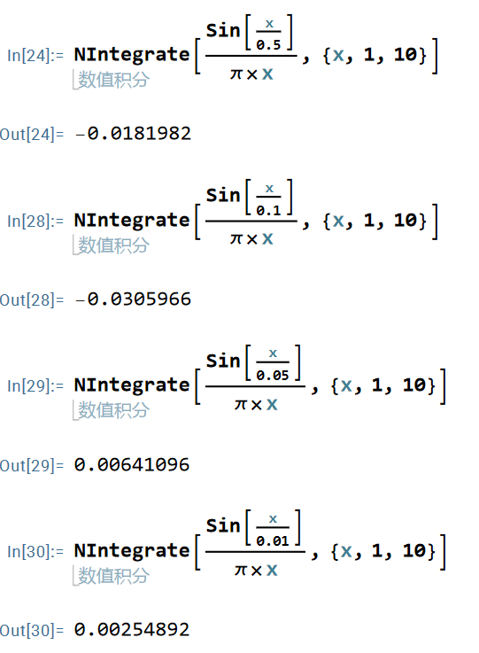

# 2.1 $\delta$函数——狄拉克函数

## 2.1.1 狄拉克函数的定义
$\delta$函数采用两个重要性质定义，分别是紧致性和归一性，如下：
$$
 \delta(x) = 
    \left\{
    \begin{array}{ll}
    0           & x \neq 0,\\
    \infty      & x = 0.
    \end{array}  
    \right.  \tag{2.1} 
$$

$$
\int_{-\infty}^{+\infty} \delta(x) \, dx = 1. \tag{2.2}
$$
其中$\delta(x)$函数其实就是在$x=0$这一点的积分等于1。满足以上两个条件的函数称为$\delta$函数。对于二维、三维空间，公式2.1和2.2可以拓展为：
$$
\delta(\vec{r}) = 
\left\{
    \begin{array}{ll}
    0           & |\vec{r}| \neq 0 \\
    \infty      & |\vec{r}| =  0.
    \end{array}  
    \right. \tag{2.3}
$$

$$
\int\int\int\delta(\vec{r})d\vec{r} = 1 \tag{2.4}
$$
其中$\vec{r}$是一个空间中的位置矢量。显然，在三维空间中$\delta(\vec{r}) = \delta(x)\delta(y)\delta(z)$满足式2.3和2.4。其中公式2.1和2.3称为$\delta$函数的**紧致性**，公式2.2和2.4称为$\delta$函数的**归一性**。

公式2.1和2.3可以推广到空间中任意一点：
$$
 \delta(x) = 
    \left\{
    \begin{array}{ll}
    0           & x \neq 0\\
    \infty      & x = 0.
    \end{array}  
    \right. \quad \Longrightarrow \quad
    \delta(x-x_0) = 
    \left\{
    \begin{array}{ll}
    0           & x \neq x_0\\
    \infty      & x = x_0.
    \end{array}  
    \right. \tag{2.5} 
$$

$$
\delta(x) = 
\left\{
    \begin{array}{ll}
    0           & |\vec{r}| \neq 0 \\
    \infty      & |\vec{r}| =  0.
    \end{array}  
    \right. \quad \Longrightarrow \quad
    \delta(\vec{r}-\vec{r}_0) = 
    \left\{
    \begin{array}{ll}
    0           & \vec{r} \neq \vec{r}_0  \\
    \infty      & \vec{r} = \vec{r}_0.
    \end{array}  
    \right. \tag{2.6}
$$
上述在空间中的推广，相当于从$x$位置平移到$x_0$位置，或者从$\vec{r}$位置平移到$\vec{r}_0$位置，都可以得到相同的结果。

## 2.1.2 狄拉克函数的性质
### 2.1.2.1 筛选性
对于任意的连续函数$f(x)$，以及定义域内的任意实数$a$，可以利用$\delta$函数筛选出$f(a)$的函数值：
$$
f(a) = \int_{-\infty}^{+\infty} f(x) \delta(x-a) \, dx. \tag{2.7}
$$

- 证明上述性质：

1. 因为$x\neq a$时，$\delta(x-a) = 0$，所以积分域可以缩小为$[a-\epsilon, a+\epsilon]$；无论$\epsilon$多小，一直可以趋近于0，包含$x = a$这一点就行。之所以可以将积分域缩小，是因为$\delta$函数在$x \neq a$位置处的$\delta(x-a) = 0$，所以相当于仅考虑$x=a$附近的情况即可。
$$
I =\int_{-\infty}^{+\infty} f(x) \delta(x-a)dx = \lim_{\epsilon \rightarrow 0^+}\int_{a-\epsilon}^{a+\epsilon} f(x)\delta(x-a)dx. \tag{2.8}
$$
1. 由于$f(x)$是连续函数，在区间$[a-\epsilon, a+\epsilon]$上必然存在一点$\xi$，根据积分中值定理：
$$
\int_{a-\epsilon}^{a+\epsilon} f(x)\delta(x-a)dx = f(\xi)\int_{a-\epsilon}^{a+\epsilon} \delta(x-a)dx. \tag{2.9}
$$
1. 公式2.9中$\xi \in [a-\epsilon, a+\epsilon]$，根据$\delta$函数的定义性质(紧致性)，将积分域还原到$[-\infty, +\infty]$，可以得到：
$$
f(\xi)\int_{a-\epsilon}^{a+\epsilon} \delta(x-a)dx = f(\xi)\int_{-\infty}^{+\infty} \delta(x-a)dx. \tag{2.10}
$$
1. 根据归一性$\int_{-\infty}^{+\infty} \delta(x-a)dx = 1$，可以得到公式2.10等于$f(\xi)$；当$\epsilon \rightarrow 0^+$时，$\xi \rightarrow a$。
$$
\int_{-\infty}^{+\infty} f(x) \delta(x-a)dx = f(a). \tag{2.11}
$$
综上所述，公式2.7是正确的。同时该公式可以推广至二维/三维空间，对于任意连续函数$f(\vec{r})$，有：
$$
f(\vec{a}) = \int f(\vec{r}) \delta(\vec{r}-\vec{a}) \, d\vec{r}. \tag{2.12}
$$

在网上找到了一篇文章中，对于$\delta$函数筛选性的另一种证明方式见下图。该方式似乎更容易理解。


### 2.1.2.2 奇偶性

在一维空间中存在$\delta(x) = \delta(-x)$，表明$\delta$函数是偶函数。在二维空间中，$\delta$函数的奇偶性可以由下式定义。三维空间同理。
$$
\left\{
\begin{array}{ll}
\delta(x, y) &= \delta(-x, y) \\
\delta(x, y) &= \delta(x, -y).
\end{array}  
\right.
$$

### 2.1.2.3 $\delta$函数的辅助函数
按照式2.1和2.3定义的函数，并非通常意义上的函数，它给出的对应关系2.1并不符合传统函数的定义。由$\delta(x)$定义可知，$\delta(x)$是某些函数序列的极限，并非传统函数那种具有唯一确定性表达式。作为举例，给出两个以$\delta(x)$为极限的函数序列：
$$
U(\beta,x) = 
\left\{
\begin{array}{ll}
\dfrac{1}{2\beta} \qquad &|x| \leq \beta\\
0 \qquad &|x| > \beta.
\end{array}  
\right. \quad \Longrightarrow \quad \lim_{\beta \rightarrow 0} U(\beta,x) = \delta(x) \tag{2.13}
$$

$$
V(\beta,x) = \dfrac{sin\beta x}{\pi x} \quad \Longrightarrow \quad \lim_{\beta \rightarrow \infty} V(\beta,x) = \delta(x) \tag{2.14}
$$


# 2.2 数值方法与计算工作者思维方式

## 2.2.1 从差分方程说起
这一节视频作者主要从差分方法求解基础的微分方程开始，然后介绍了数值方法的一些基本原理。

求解下列微分方程：
$$
\dfrac{dy}{dx} = sin(x) \tag{2.15}
$$

边界条件：$x= 0$时$y=0$。基于此导出微分方程的解析解为：$y = 1 - cos(x)$。

令$\Delta x = 0.1$，$y = f(x)$方便表述；主要采用两种简单的差分方式求解示例：

1. $f(x + \Delta x) \approx f(x) + \Delta xsin(x)$，例如$f(0.1) \approx f(0) + 0.1 \times sin(0)$，后续每一个点类推。这就相当于用差分方式表达$f(x)$的导数定义。

2. 如果想要更加精确的解，可以采用中心差分，即$f(x + \Delta x) \approx f(x) + sin(x+ \dfrac{\Delta x}{2}) \Delta x$。

## 2.2.2 编程实现

具体的编程实现可以参考`sourceCode/SPH-02-FDM/main.cpp`中的程序源码。

```cpp
#include <iostream>
#include <vector>
#include <direct.h>
#include <math.h>
#include <windows.h>
#include <sys/stat.h>
#include <fstream>
#include <filesystem>
#include "SPH02-FDM.h"
#define M_PI 3.14159265358979323846

namespace fs = std::filesystem;

int main()
{
    // 声明变量等具体参考源程序

    // 给x数组赋值
    for (int i = 1; i < xAarry.size(); i++)
    {
        xAarry[i] = xAarry[i - 1] + h;
    }

    // 第一种差分格式，计算Y的数值解
    for (int i = 1; i < xAarry.size() - 1; i++)
    {
        y1ArrayNumericalSolution[i] = y1ArrayNumericalSolution[i - 1] + std::sin(xAarry[i - 1]) * h;
    }

    // 第二种差分格式，计算Y的数值解
    for (int i = 1; i < xAarry.size() - 1; i++)
    {
        y2ArrayNumericalSolution[i] = y2ArrayNumericalSolution[i - 1] + std::sin(xAarry[i - 1] + h / 2.0) * h;
    }

    // 计算解析解`
    for (int i = 0; i < xAarry.size(); i++)
    {
        yArrayAnalyticalSolution[i] = 1.0 - std::cos(xAarry[i]);
    }
    /// ....
    // 写出数据代码，参考源码
    return 0;
}
```
通过编码计算发现，采用12个点，第二种差分方式的结果明显优于第一种方式。具体可见


## 2.2.3 差分方法基本思想

- 由前述编程求解方程可知，差分方法求解的不是一个解析式，而是某些具体的x上的函数值y；

- 差分方法将$dy/dx$写成$y$和$x$的代数式，将微分方程转换为代数方程，从而求解。SPH处理微分方程的原理类似。

# 2.3 $\delta$辅助函数数值性质

本小节的课程需要用到数学软件mathematica进行数值试验。建议全程听视频讲解吸收消化，主要是为了掌握从$\delta$函数逐渐导出SPH方法的过程。

## 2.3.1 考察第一个$\delta$函数的辅助函数：
$$
V_1(\beta,x) = \dfrac{sin \dfrac{\beta}{x}}{\pi x} \tag{2.16}
$$

注意$V_1(\beta,x)$与公式2.14等价；显然对于$V_1(\beta,x)$有$\lim_{\beta \rightarrow 0} V_1(\beta,x) = \delta(x)$。

采用Mathematica绘制$V_1(\beta,x)$的图像，揭示其规律：

1. 对$V_1(\beta,x)$进行积分计算，积分域为$[-\infty,+\infty]$，结果为$1$，即公式2.16符合**归一性**要求。其中保证$\beta$为正实数。


2. 探讨$V_1(\beta,x)$的紧致性；


- 图中红色、绿色曲线分别表示$\beta=0.1$和$\beta=0.5$的图像；
- 在远离$x=0$的范围内，$V_1(\beta,x)$震荡减小，接下来探讨$V_1(\beta,x)$的震荡性是否与$\beta$有关。在$x\in [1,10]$区间内对$V_1(\beta,x)$进行积分，$\beta$分别取$0.5,0.1,0.05,0.01$。



从$V_1(\beta,x)$积分结果和函数图像可看出，其震荡幅度与$\beta$大小无关，反而与$x$积分范围有关；即选取某区间的积分，可以只包括正的震荡或负的震荡。进一步对$|V_1(\beta,x)|$绝对值进行积分，为了观察震荡性，选取积分区间为$x\in [1,3]$，结果如下：


从积分结果可以看出，$V_1(\beta,x)$函数的震荡性与$\beta$无关，但是其函数的紧致性是通过正负方向的震荡相互抵消来维持。

### 2.3.1.1 结论
- $V_1(\beta,x)$震荡衰减；随着$|x|$增大，震荡幅度减小；
- 随着$\beta$减小，震荡频率增大；$x=0$时，$\beta$越小，震荡峰值越大；
- 根据$\int_1^3|V_1(\beta,x)|dx$积分结果，可以看出$V_1(\beta,x)$函数的震荡幅度，与$\beta$无关。

## 2.3.2 考察第二个$\delta$函数的辅助函数
$$
V_2(\beta,x) = 
\left\{
\begin{array}{ll}
\dfrac{5}{4\beta}\left(1+3\dfrac{|x|}{\beta}\right)\left(1-\dfrac{|x|}{\beta}\right)^3 \qquad &|x| \leq \beta\\[15pt]
0 \qquad &|x| > \beta.
\end{array}  
\right. \tag{2.17}
$$

1. $V_2(\beta,x)$的积分结果为$1$，满足**归一性**要求，其中$\beta > 0$；


2. 探讨$V_2(\beta,x)$的紧致性，取不同的$\beta = 0.1, 0.2, 0.5$绘制函数图像：


### 2.3.2.1 结论
- $V_2(\beta,x)$函数在$(-\infty,+\infty)$上全部可导；
- $\beta$越小，$V_2(\beta,x)$函数在$x=0$的峰值越大；
- 在$(-\infty,+\infty)$，满足$V_2(\beta,x) \geq 0$；
- 当$|x| \geq \beta$时，$V_2(\beta,x) = 0$；严格满足**紧致性**要求；
- 当$x < 0$时，$V_2(\beta,x)$单调递增；当$x > 0$时，$V_2(\beta,x)$单调递减；
- $V_2(\beta,x)$仅在$x=0$处取极大值；
- $V_2(\beta,x)$关于$Y$轴对称，为偶函数。

>通过上述两个$\delta$函数的辅助函数的考察，可以发现，$\delta$函数的辅助函数的数值性质与SPH方法的数值特性息息相关。

## 2.3.3 原函数近似
公式2.7揭示了$\delta$函数的筛选性，如果将其中的$\delta$函数换成$\delta$函数的辅助函数，则可以得到SPH方法的基本形式。

$$
f(a) \approx \int_{-\infty}^{+\infty} f(x) V(\beta,x-a) \, dx. \tag{2.18}
$$

其中$V(\beta,x-a)$是$\delta$函数的辅助函数。当$\beta \rightarrow 0$时，$V(\beta,x-a) = \delta(x-a)$，即$\delta$函数的辅助函数近似了$\delta$函数。采用公式2.16和2.17两个辅助函数分别进行数值试验，并且其中原函数$f(x) = sinx + cosx$。

采用Mathematica求:
$$
\int_{-\infty}^{+\infty} V(\beta,x)(sinx+cosx)dx
$$

取$\beta = 0.1$，分别在区间$x\in [-0.1,0.1]$和$x\in [-1,1]$上对进行积分，结果如下：


可以看出，在同样的积分区间$x\in [-0.1,0.1]$上，采用$V_2(\beta,x)$辅助函数的近似误差远小于$V_1(\beta,x)$辅助函数的近似误差。尽管将积分区间扩大到$x\in [-1,1]$，$V_1(\beta,x)$的近似误差依然大于$V_2(\beta,x)$的近似误差，但同时计算量会更大。说明采用$V_2(\beta,x)$辅助函数对原函数$f(x)$的筛选性明显更优秀。

### 2.3.3.1 数值试验结论
- $V_1(\beta,x)$辅助函数对原函数$f(x)$的筛选性远不如$V_2(\beta,x)$；
- 猜想：具有震荡性的辅助函数，筛选性更差。

## 2.3.4 导函数近似

数值方法中最重要的近似就是导函数近似；考察如下形式：
$$
\dfrac{df}{dx}\mid_{x=a} \approx \int_{-\infty}^{+\infty} V(\beta,x-a) \dfrac{df(x)}{dx} \, dx. \tag{2.19}
$$

上式中，$V(\beta,x-a)$是$\delta$函数的辅助函数(是已知函数)，$f(x)$是原函数。采用公式2.16和2.17两个辅助函数分别进行数值试验。按照高数的分部积分原则有：
$$
\int_{-\infty}^{+\infty} V(\beta,x-a) \dfrac{df(x)}{dx} \, dx = \int_{-\infty}^{+\infty} V(\beta,x-a)df(x)\\[12pt]
= V(\beta,x-a) \int_{-\infty}^{+\infty} f(x) \, dx - \int_{-\infty}^{+\infty}f(x) \dfrac{dV(\beta,x-a)}{dx} \, dx
$$

从上式可以观察到，辅助函数必须满足可导性，同时要存在明确的紧致性边界条件。如果辅助函数是震荡衰减，没有明确紧致边界，积分范围会非常大，导致截断误差很大。综上可以选取2.17作为辅助函数变化为公式2.19。
$$
V_2(\beta,x-a) = 
\left\{
\begin{array}{ll}
\dfrac{5}{4\beta}\left(1+3\dfrac{|x-a|}{\beta}\right)\left(1-\dfrac{|x-a|}{\beta}\right)^3 \qquad &|x-a| \leq \beta\\[15pt]
0 \qquad &|x-a| > \beta.
\end{array}  
\right. \tag{2.19}
$$

由于公式2.19存在明确的紧致性边界，在$|x-a|>\beta$范围里，辅助函数都等于零；所以积分范围限制在$x\in [a-\beta,a+\beta]$。
$$
\int_{-\infty}^{+\infty} V(\beta,x-a) \dfrac{df(x)}{dx} \, dx = \int_{a-\beta}^{a+\beta} V(\beta,x-a) \dfrac{df(x)}{dx} \, dx \\[12pt]
=V(\beta,x-a) \int_{a-\beta}^{a+\beta} f(x) \, dx - \int_{a-\beta}^{a+\beta}f(x) \dfrac{dV(\beta,x-a)}{dx} \, dx
$$

将积分上下限$x=a+\beta, a-\beta$分别代入$V(\beta,x-a)$，会发现$V(\beta,\beta) = V(\beta,-\beta) = 0$，所以上述积分式变形为：
$$
\int_{-\infty}^{+\infty} V(\beta,x-a) \dfrac{df(x)}{dx} \, dx = - \int_{a-\beta}^{a+\beta}f(x) \dfrac{dV(\beta,x-a)}{dx} \, dx
$$

通过上述推导可以知道，原函数的导数近似成辅助函数的导数的积分形式。
$$
\dfrac{df}{dx}\mid_{x=a} = - \int_{a-\beta}^{a+\beta}f(x) \dfrac{dV(\beta,x-a)}{dx} \, dx \tag{2.20}
$$

### 2.3.4.1 导函数近似数值试验
$$
V(\beta,x-a) = 
\left\{
\begin{array}{ll}
\dfrac{5}{4\beta}\left(1+3\dfrac{|x-a|}{\beta}\right)\left(1-\dfrac{|x-a|}{\beta}\right)^3 \qquad &|x-a| \leq \beta\\[15pt]
0 \qquad &|x-a| > \beta.
\end{array}  
\right. 
$$

$$
\dfrac{dV(\beta,x-a)}{dx} = 
\left\{
\begin{array}{ll}
\dfrac{15}{4\beta^2}\left(1+\dfrac{x-a}{\beta}\right)^2\left[\left(1-3\dfrac{x-a}{\beta}\right)-\left(1+\dfrac{x-a}{\beta}\right)\right] \qquad &a-\beta \leq x \leq a\\[15pt]
\dfrac{15}{4\beta^2}\left(1-\dfrac{x-a}{\beta}\right)^2\left[\left(1-\dfrac{x-a}{\beta}\right)-\left(1+3\dfrac{x-a}{\beta}\right)\right] \qquad &a \leq x \leq a + \beta\\[15pt]
0 \qquad &|x-a| > \beta.
\end{array} 
\right.     
$$

取$\beta = 0.1$，$a=\pi$，假设$f(x) = sinx+cosx$进行数值试验；公式2.20可以转化为：
$$
\int_{a-\beta}^{a+\beta}f(x) \dfrac{dV(\beta,x-a)}{dx} \, dx = -\left(\dfrac{df}{dx}\mid_{x=a}\right)
$$

一般数值计算中，$f(x)$是未知函数，需要求其导函数；通过假设的$f(x)$可以来验证数值试验的精度和正确性。
$$
\dfrac{df}{dx} = cosx - sinx \Longrightarrow  \dfrac{df}{dx}\mid_{x=\pi} = -1
$$


可以看出，通过减小$\beta$值，导函数近似的精度会逐渐提高；对于原函数导数的近似结果相当精准，这也说明选择的辅助函数很合理。

# 2.4 SPH方法近似
## 2.4.1 核插值
### 2.4.1.1 原函数核插值

将公式2.7和2.12公式中的$\delta$函数替换成核函数$W$，就称为**SPH核插值**。公式2.7变化为公式2.21，如下：
$$
\langle f(\mathbf{x}) \rangle := \int f(\mathbf{x}') W(\mathbf{x}-\mathbf{x}',h) \, d\mathbf{x}' \tag{2.21}
$$

- 其中，$W(\mathbf{x}-\mathbf{x}',h)$是SPH核函数，相当于一种特殊的$\delta$函数的辅助函数；
- $h$是核函数的半径；
- 符号"$\langle \cdot \rangle$"表示SPH核插值算子；
- $\mathbf{x}$与$\mathbf{x}'$表示空间中粒子的位置，矢径向量；
- $d\mathbf{x}'$在一维、二维、三维空间中分别表示为$dx', \quad dx'dy', \quad dx'dy'dz'$；二维/三维如下：
$$
\langle f(x,y) \rangle := \int f(x',y') W(x-x',y-y',h) \, dx'dy'\\[12pt]
\langle f(x,y,z) \rangle := \int f(x',y',z') W(x-x',y-y',w-w',h) \, dx'dy'dz'
$$
- 积分范围取核函数$W$的紧致区间；
- 根据核函数定义，可知$h \to 0$时，$W(\mathbf{x}-\mathbf{x}',h) \to \delta(\mathbf{x}-\mathbf{x}')$；因此存在：

$$
\lim_{h \to 0}\langle f(x) \rangle = f(x) \\[10pt]
\lim_{h \to 0}\langle f(x,y) \rangle = f(x,y) \\[10pt]
\lim_{h \to 0}\langle f(x,y,z) \rangle = f(x,y,z)
$$

### 2.4.1.2 分部积分
#### 2.4.1.2.1 一维空间的分部积分
$$
\int_{a }^{b}u\dfrac{dv}{dx}dx = uv|_{a}^{b} - \int_{a}^{b}v\dfrac{du}{dx}dx \tag{2.22}
$$
#### 2.4.1.2.2 二维空间的分部积分
根据导数公式，存在：
$$
\dfrac{\partial(uv)}{\partial x} = u\dfrac{\partial v}{\partial x} + v\dfrac{\partial u}{\partial x} \quad \Longrightarrow \quad u\dfrac{\partial v}{\partial x} = \dfrac{\partial(uv)}{\partial x} - v\dfrac{\partial u}{\partial x}
$$
$$
\dfrac{\partial(uv)}{\partial y} = u\dfrac{\partial v}{\partial y} + v\dfrac{\partial u}{\partial y} \quad \Longrightarrow \quad u\dfrac{\partial v}{\partial y} = \dfrac{\partial(uv)}{\partial y} - v\dfrac{\partial u}{\partial y}
$$

对上述两式等号两端做二重面积分：
$$
\iint\limits_{V}u\dfrac{\partial v}{\partial x}dxdy = \underbrace{\iint\limits_{V}\dfrac{\partial(uv)}{\partial x}dxdy} - \iint\limits_{V}v\dfrac{\partial u}{\partial x}dxdy \tag{2.23}
$$
$$
\iint\limits_{V}u\dfrac{\partial v}{\partial y}dxdy = \underbrace{\iint\limits_{V}\dfrac{\partial(uv)}{\partial y}dxdy} - \iint\limits_{V}v\dfrac{\partial u}{\partial y}dxdy \tag{2.24}
$$

基于**格林公式** $\displaystyle\iint\limits_{V}\left(\dfrac{\partial Q}{\partial x} - \dfrac{\partial P}{\partial y}\right)dxdy = \displaystyle\oint\limits_S(Pdx+Qdy)$，将面积分转化为面的边界积分之和；并代入到公式2.23与2.24中：
$$
\iint\limits_{V}u\dfrac{\partial v}{\partial x}dxdy = \underbrace{\oint\limits_S(uv)dy} - \iint\limits_{V}v\dfrac{\partial u}{\partial x}dxdy \tag{2.25}
$$
$$
\iint\limits_{V}u\dfrac{\partial v}{\partial y}dxdy = \underbrace{-\oint\limits_S(uv)dx} - \iint\limits_{V}v\dfrac{\partial u}{\partial y}dxdy \tag{2.26}
$$

#### 2.4.1.2.3 三维空间的分部积分
推导过程与二维空间类似，其中需要运用**高斯定理**，结果为：
$$
\iiint\limits_V u\dfrac{\partial v}{\partial x}dxdydz = \oiint\limits_S(uv)dydz - \iiint\limits_{V}v\dfrac{\partial u}{\partial x}dxdydz \tag{2.27}
$$
$$
\iiint\limits_V u\dfrac{\partial v}{\partial y}dxdydz = \oiint\limits_S(uv)dxdz - \iiint\limits_{V}v\dfrac{\partial u}{\partial y}dxdydz \tag{2.28}
$$
$$
\iiint\limits_V u\dfrac{\partial v}{\partial z}dxdydz = \oiint\limits_S(uv)dxdy - \iiint\limits_{V}v\dfrac{\partial u}{\partial z}dxdydz \tag{2.29}
$$

### 2.4.1.3 导函数的核插值
#### 2.4.1.3.1 一维空间的导函数核插值
其实一维空间的导函数核插值在2.3.4小节的数值试验中已经推导。
$$
\langle \dfrac{df(x)}{dx} \rangle := \int W(x-x',h)\dfrac{df(x')}{dx'} \, dx' \tag{2.30}
$$
当$h \to 0$时，$W(x-x',h) \to \delta(x-x')$，因此导函数的核插值严格近似于原函数的导数。根据一维空间分部积分形式2.22公式可知：
$$
\int W(x-x',h)\dfrac{df(x')}{dx'} \, dx' = W(x-x',h)f(x')\displaystyle|_a^b - \int f(x')\dfrac{dW(x-x',h)}{dx'} \, dx' \tag{2.31}
$$
式2.31中的$W(x-x',h)$满足紧致性，在边界$a,b$处有$W(x-x',h)f(x')\displaystyle|_a^b = 0$；所以：
$$
\langle \dfrac{df(x)}{dx} \rangle = \int W(x-x',h)\dfrac{df(x')}{dx'} \, dx' = - \int f(x')\dfrac{dW(x-x',h)}{dx'} \, dx' \tag{2.32}
$$

公式2.32即为**一维空间导函数核插值的公式**。


#### 2.4.1.3.2 二维空间的导函数核插值
$$
\langle \dfrac{\partial f(\mathbf{r})}{\partial x} \rangle := \iint W(\mathbf{r}-\mathbf{r}',h)\dfrac{\partial f(\mathbf{r}')}{\partial x'} \, d\mathbf{r}' \tag{2.33}
$$
其中$\mathbf{r}$表示粒子位置矢径；根据二维空间分部积分形式2.25、2.26可知：
$$
\iint W(\mathbf{r}-\mathbf{r}',h)\dfrac{\partial f(\mathbf{r}')}{\partial x'} \, d\mathbf{r}' = \oint\limits_S W(\mathbf{r}-\mathbf{r}')f(\mathbf{r}')dy' - \iint\limits_{V} f(\mathbf{r}')\dfrac{\partial W(\mathbf{r}-\mathbf{r}',h)}{\partial x'} \, d\mathbf{r}' \tag{2.34}
$$

由$W(\mathbf{r}-\mathbf{r}',h)$的紧致性可知，在面的边界积分值$\displaystyle\oint\limits_S W(\mathbf{r}-\mathbf{r}')f(\mathbf{r}')dy' = 0$；所以：
$$
\langle \dfrac{\partial f(\mathbf{r})}{\partial x} \rangle = - \iint\limits_{V} f(\mathbf{r}')\dfrac{\partial W(\mathbf{r}-\mathbf{r}',h)}{\partial x'} \, d\mathbf{r}' \tag{2.35}
$$
公式即为对$x$求导的核插值，同理得到对$y$求导的核插值为：
$$
\langle \dfrac{\partial f(\mathbf{r})}{\partial y} \rangle = - \iint\limits_{V} f(\mathbf{r}')\dfrac{\partial W(\mathbf{r}-\mathbf{r}',h)}{\partial y'} \, d\mathbf{r}' \tag{2.36}
$$

#### 2.4.1.3.3 三维空间的导函数核插值
$$
\langle \dfrac{\partial f(\mathbf{r})}{\partial x} \rangle = - \iiint\limits_{V} f(\mathbf{r}')\dfrac{\partial W(\mathbf{r}-\mathbf{r}',h)}{\partial x'} \, d\mathbf{r}' \tag{2.35}
$$
$$
\langle \dfrac{\partial f(\mathbf{r})}{\partial y} \rangle = - \iiint\limits_{V} f(\mathbf{r}')\dfrac{\partial W(\mathbf{r}-\mathbf{r}',h)}{\partial y'} \, d\mathbf{r}' \tag{2.38}
$$
$$
\langle \dfrac{\partial f(\mathbf{r})}{\partial z} \rangle = - \iiint\limits_{V} f(\mathbf{r}')\dfrac{\partial W(\mathbf{r}-\mathbf{r}',h)}{\partial z'} \, d\mathbf{r}' \tag{2.39}
$$

#### 2.4.1.3.4 导函数核插值统一格式
一维、二维、三维空间导函数核插值的推导形式相似，可以将其统一为：
$$
\langle \nabla f(\mathbf{r}) \rangle = -\int\limits_V f(\mathbf{r}')\nabla W(\mathbf{r}-\mathbf{r}',h)d\mathbf{r}' \tag{2.40}
$$
其中$\nabla$表示哈密顿算子，即**梯度符号**；$\mathbf{r}$表示粒子位置矢径，$W(\mathbf{r}-\mathbf{r}',h)$表示核函数。在笛卡尔坐标系中，一维、二维与三维空间哈密顿算子可展开为如下形式：
$$
\nabla := \dfrac{d}{dx}
$$
$$
\nabla := \dfrac{\partial}{\partial x}\vec{i} + \dfrac{\partial}{\partial y}\vec{j}
$$
$$
\nabla := \dfrac{\partial}{\partial x}\vec{i} + \dfrac{\partial}{\partial y}\vec{j} + \dfrac{\partial}{\partial z}\vec{k}
$$

## 2.4.2 粒子离散：一维问题


